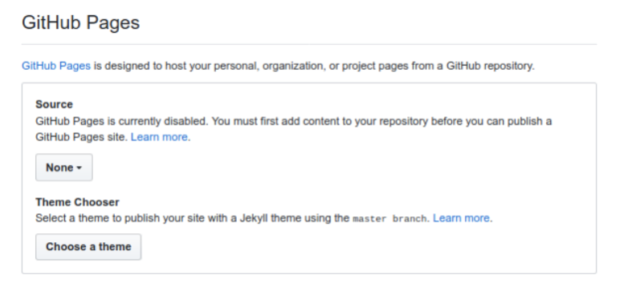
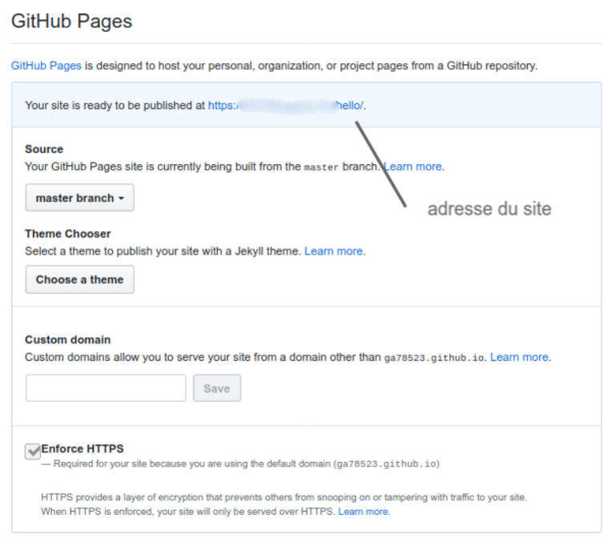
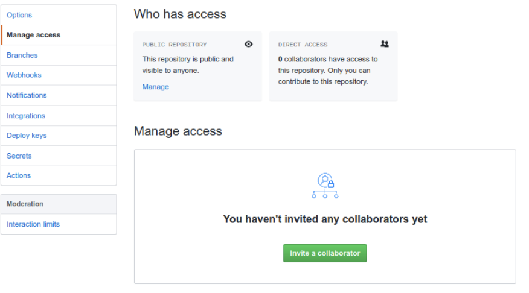

#  Les outils git et github

## Introduction (wikipedia)

Git est un logiciel de gestion de versions décentralisé. C’est un logiciel libre créé par Linus Torvalds,
auteur du noyau Linux, et distribué selon les termes de la licence publique générale GNU version 2. En 2016,
il s’agit du logiciel de gestion de versions le plus populaire.
GitHub exploité sous le nom de GitHub, Inc.) est un service web d’hébergement et de gestion de développement de logiciels, utilisant le logiciel de gestion de versions Git. Ce site est développé en Ruby on Rails
et Erlang par Chris Wanstrath, PJ Hyett et Tom Preston-Werner. GitHub propose des comptes professionnels payants, ainsi que des comptes gratuits pour les projets de logiciels libres. Le site assure également un
contrôle d’accès et des fonctionnalités destinées à la collaboration comme le suivi des bugs, les demandes de
fonctionnalités, la gestion de tâches et un wiki pour chaque projet.
En avril 2016, GitHub a annoncé avoir dépassé les 14 millions d’utilisateurs et plus de 35 millions de
dépôts de projets le plaçant comme le plus grand hébergeur de code source au monde.

## Sur votre ordinateur : git

### Téléchargement, installation et configuration

1. Se rendre sur le site : [https://git-scm.com/downloads](https://git-scm.com/downloads)
2. Télécharger le logiciel pour le système d’exploitation que vous avez ;
3. Se rendre dans la console et taper : `git --version` pour vous assurer que cela a bien fonctionner.

### Configurer git :

``` console
git config --global user.email "you@example.com "
git config --global user.name "your Name"
```
### Utilisation

1. On crée un dossier. Par exemple : Hello ;
2. Dans ce dossier, on crée la page hello.html suivante :

``` html linenums="1"
<!DOCTYPE html>
<html>
    <head>
        <meta charset="utf8">
        <title>essai git et github</title>
    </head>
    <body>
        <h1>Bonjour tout le monde</h1>
    </body>
</html>
```

1. On l’enregistre ;
2. Avec la console, se rendre dans le dossier Hello en ligne de commande ;
3. Dans le dossier Hello, taper : `git init` pour commencer à versionner le projet ;
4. Pour faire une "photo" de votre projet à un instant t, il faut en faire un commit. Cela se déroule en
deux étapes :
   * Vérifier que tout est en ordre. Pour cela taper : `git add .`
   * Faire la "photo". Taper : `git commit -m "Premier commit"` pour "pousser" votre projet sur le serveur.

!!! example "Exercice 1 :"
    Faire un modification du fichier `hello.html` puis en faire un commit.

## Sur internet : GitHub

### Préalable

1. Se rendre sur github : [https://github.com/](https://github.com/) ;
2. S’inscrire ;

### Pour le projet Hello

1. Aller sur new repository ;
2. Taper le nom : `Hello` ;
3. Github vous donne ensuite la démarche à suivre. Dans notre cas, il faut recopier les lignes suivantes dans la console pour indiquer à votre ordinateur le serveur git qui va recevoir votre projet ;

```  html
git remote add origin https://github.com/yourLogin/hello.git 
git push -u origin master
```

### Pour obtenir l’hébergement de sa page html

**1** Une fois dans votre projet, se rendre sur settings.

**2** Descendre, jusqu’à :

<figure markdown>
{width=400px}
</figure>

**3** Cliquer dans source sur `None` et choisir `Master`.

**4** Vous devriez obtenir un écran du type :

<figure markdown>
{width=400px}
</figure>

**5** Au prochain "push", votre site sera visible à l’adresse indiquée.

### Inviter des personnes

1. Dans votre projet, se rendre sur `settings` ;
2. Aller dans `manage access` et rentrer le nom de la personne. Vous devriez obtenir cette fenetre :

<figure markdown>
{width=400px}
</figure>

## Les commandes git de bases (wikipedia)
   
* `git init` : crée un nouveau dépôt ;
* `git clone` : clone un dépôt distant ;
* `git add`: ajoute de nouveaux objets blobs dans la base des objets pour chaque fichier modifié depuis
le dernier commit. Les objets précédents restent inchangés ;
* `git commit` : intègre la somme de contrôle SHA*1 d’un objet tree et les sommes de contrôle des
objets commits parents pour créer un nouvel objet commit ;
* `git branch` : liste les branches ;
* `git merge` : fusionne une branche dans une autre ; git rebase déplace les commits de la branche
courante devant les nouveaux commits d’une autre branche ;
* `git log` : affiche la liste des commits effectués sur une branche ;
* `git push` : publie les nouvelles révisions sur le remote. (La commande prend différents paramètres) ;
* `git pull` : récupère les dernières modifications distantes du projet (depuis le Remote) et les fusionne
dans la branche courante ;
* `git stash` : stocke de côté un état non commité afin d’effectuer d’autres tâches