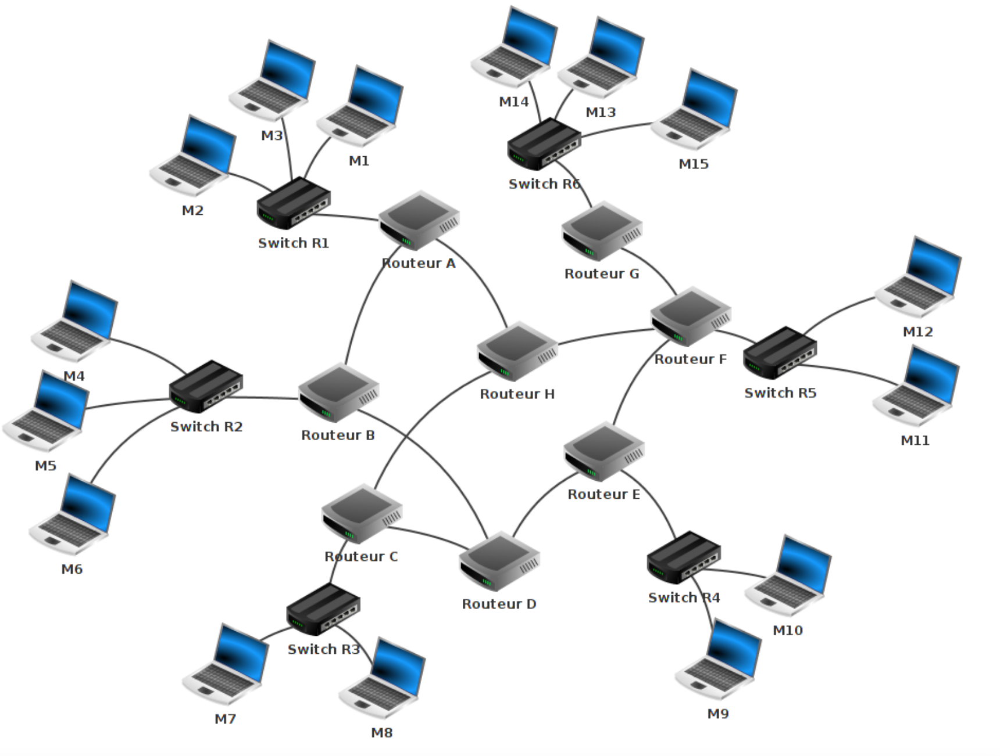
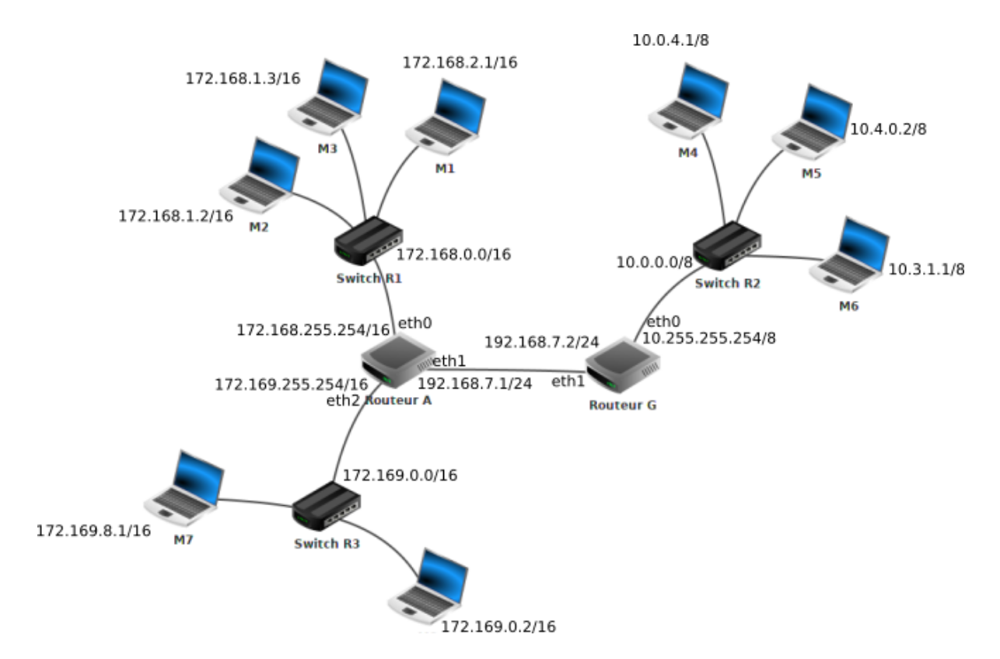
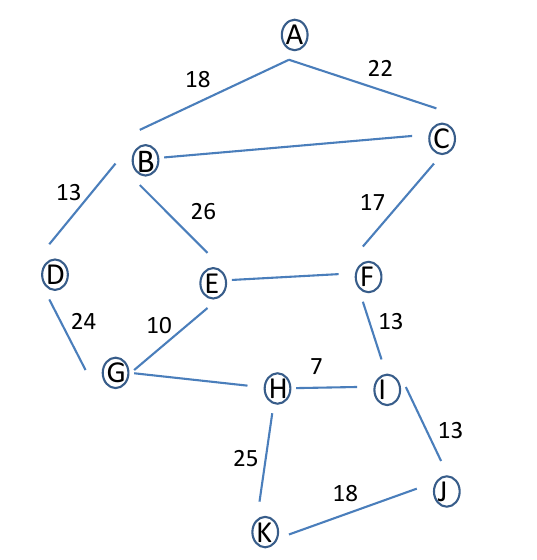

# Protocoles de routage

## Introduction au routage

Dans un réseau informatique, les informations échangées entre les machines doivent suivre un chemin bien défini pour atteindre leur destination. Cette tâche complexe est assurée par un mécanisme essentiel : le routage.

Imaginez un réseau comme une immense carte routière où chaque ville représente un appareil (ordinateur, imprimante, smartphone) et chaque route, une liaison physique ou logique. Lorsqu’un message est envoyé, il doit emprunter le meilleur chemin pour arriver à bon port, même si plusieurs itinéraires sont possibles ou si certaines routes sont bloquées.

Le routage est donc le processus permettant à ces messages – appelés paquets – de trouver leur chemin dans ce réseau de plus en plus complexe, qu'il s'agisse d'un réseau local (LAN) ou de l'immensité d'Internet.

## Rappels

!!! success "Définition d'un réseau informatique :"
    Un réseau informatique un ensemble d'équipements informatiques reliés entre-eux afin d'échanger des données.

!!! success "Définition d'une adresse IP :"
    L’adressage consiste à affecter une adresse unique (numéro d’identification) permanente ou provisoire à chaque appareil
    connecté à un réseau informatique. C’est-à-dire qu’il n’existe pas sur internet deux ordinateurs ayant la même adresse IP
    sur le même réseau.

    Il existe des adresses IP de version 4 (sur 32 bits, soit 4 octets) et de version 6 (sur 128 bits, soit 16 octets).
    Une adresse IPV4 est une adresse notée sous forme de 4 nombres sous la forme (A.B.C.D) entiers séparés par des
    points (codé sur 32 bits).
    Exemple : 192.168.0.13

!!! success "Définition d'un masque de sous-réseau :"
    Un masque de sous-réseau (désigné par subnet mask, netmask ou address mask en anglais) est un masque distinguant les bits d'une adresse IPv4 utilisés pour identifier le sous-réseau de ceux utilisés pour identifier l'hôte.

    Une forme plus courte est connue sous le nom de « notation CIDR » (Classless Inter-Domain Routing). Elle donne le numéro du réseau suivi par une barre oblique (ou slash, « / ») et le nombre de bits à 1 dans la notation binaire du masque de sous-réseau. Le masque 255.255.224.0, équivalent en binaire à 11111111.11111111.11100000.00000000, sera donc représenté par /19 (19 bits à la valeur 1, suivis de 13 bits 0).

!!! success "Adresse de sous-réseau :"
    L'adresse du sous-réseau est obtenue en appliquant l'opérateur ET binaire entre l'adresse IP et le masque de sous-réseau. L'adresse de l'hôte à l'intérieur du sous-réseau est quant à elle obtenue en appliquant l'opérateur ET entre l'adresse IP et le complément à un du masque.

!!! success "Définition d'une adresse MAC :"
    Une adresse MAC est également appelée adresse matérielle ou adresse Ethernet. C'est un identifiant unique et propre à la carte réseau de l'ordinateur. Une adresse MAC présente généralement le format XX-XX-XX-XX-XX-XX, chaque X représentant un chiffre ou une lettre de A à F

!!! success "Définition d'un switch :"
    Le switch ou commutateur réseau est un boitier multiport servant à réceptionner et à redistribuer les informations sur le réseau. Ce boitier peut être constitué de 4 à plusieurs centaines de ports. Outre le fait de pouvoir connecter du matériel informatique sur le même réseau Ethernet (postes de travail, imprimante...), il contribue également à la sécurité du réseau et à protéger les données qui y transitent.

!!! success "Définition d'un routeur :"
    Un routeur est composé d’un nombre plus ou moins important d’interfaces réseau (cartes réseau). Les routeurs les plus simples que l’on puisse rencontrer permettent de relier ensemble deux réseaux (ils possèdent alors 2 interfaces réseau), mais il existe des routeurs capables de relier ensemble une dizaine de réseaux. N'importe quel ordinateur peut jouer le rôle de routeur (à partir du moment où il possède au moins 2 interfaces réseau), mais on rencontre souvent des "machines" dédiées (par exemple de marque CISCO)

!!! success "Définition d'internet :"
    Internet résulte de l’interconnexion de réseaux par des routeurs.

## Problématique du routage

*Figure 1 : Exemple réseau 1*

Sur le schéma de la *Figure 1*, les éléments suivants sont présents :

* 15 ordinateurs : M1 à M15
* 6 switchs : R1 à R6
* 8 routeurs : A, B, C, D, E, F, G et H

Nous avons 6 réseaux locaux, chaque réseau local possède son propre switch.

Les ordinateurs M1, M2 et M3 appartiennent au réseau local 1. Les ordinateurs M4, M5 et M6 appartiennent au réseau local 2. Nous pouvons synthétiser tout cela comme suit :

* réseau local 1 : M1, M2 et M3
* réseau local 2 : M4, M5 et M6

!!! example "Exercice 1 :"

    Complétez de la même manière :

    * réseau local 3 : .....................
    * réseau local 4 : .....................
    * réseau local 5 : .....................
    * réseau local 6 : .....................

Voici quelques exemples de communications entre 2 ordinateurs :

1. **Cas n°1 : M1 veut communiquer avec M3**  
   Le paquet est envoyé de M1 vers le switch R1, R1 "constate" que M3 se trouve dans le réseau local 1, le paquet est donc envoyé directement vers M3.  
   *Trajet du paquet* : M1 → R1 → M3

2. **Cas n°2 : M1 veut communiquer avec M6**  
   Le paquet est envoyé de M1 vers le switch R1, R1 constate que M6 n’est pas dans le réseau local 1 et envoie le paquet vers le routeur A. Le routeur A envoie le paquet au routeur B, qui est connecté au réseau local 2.  
   Le paquet est ensuite envoyé du switch R2 à la machine M6.  
   *Trajet du paquet* : M1 → R1 → Routeur A → Routeur B → R2 → M6

3. **Cas n°3 : M1 veut communiquer avec M9**  
   *Trajet du paquet* : M1 → R1 → Routeur A → Routeur B → Routeur D → Routeur E → R4 → M9

   Il est important de noter que le chemin mentionné ci-dessus n’est pas l’unique possibilité. Un autre chemin aurait pu être :  
   *Trajet alternatif* : M1 → R1 → Routeur A → Routeur H → Routeur F → Routeur E → R4 → M9  
   Il existe souvent plusieurs chemins possibles pour relier 2 ordinateurs.

4. **Cas n°4 : M13 veut communiquer avec M9**  
   Nous pouvons avoir :  
   M13 → R6 → Routeur G → Routeur F → Routeur E → R4 → M9  
   Ou encore :  
   M13 → R6 → Routeur G → Routeur F → Routeur H → Routeur C → Routeur D → Routeur E → R4 → M9  

   Dans ce cas, bien que le chemin "Routeur F → Routeur E" puisse être plus rapide, l’existence d’autres chemins, comme "Routeur F → Routeur H", permet d'assurer la communication même en cas de problème technique.

!!! example "Exercice 2:"
    Déterminer un chemin possible permettant d’établir une connexion entre la machine M4 et M14.

## Table de routage

La question qui se pose est la suivante : comment les switchs ou les routeurs amènent-ils les paquets à bon port ?

Nous savons que 2 machines appartenant au même réseau local doivent avoir la même adresse réseau. Par exemple, M1 et M4 n'ont pas la même adresse réseau (elles n'appartiennent pas au même réseau local). Si M1 cherche à communiquer avec M4, le switch R1 envoie le paquet au routeur A, car il constate que M4 n’appartient pas au réseau local 1.

Les tables de routage sont des informations stockées dans le routeur permettant d'aiguiller intelligemment les données qui lui sont transmises.

### Exemple de schéma

<figure markdown>

<caption> 
Table de routage simplifiée du routeur A
</caption>
</figure>

Vous avez sans doute remarqué que nous avons 2 routeurs :

* Le routeur A, qui possède 3 interfaces réseau nommées eth0, eth1 et eth2. Les adresses IP associées sont :  
  
  * eth0 : 172.168.255.254/16  
  * eth1 : 192.168.7.1/24  
  * eth2 : 172.169.255.254/16

* Le routeur G, qui possède 2 interfaces réseau nommées eth0 et eth1. Les adresses IP associées sont :  

  * eth0 : 10.255.255.254/8  
  * eth1 : 192.168.7.2/24

Voici les informations présentes dans la table de routage du routeur A :

* Le routeur A est directement relié au réseau 172.168.0.0/16 via son interface eth0.
* Il est directement relié au réseau 172.169.0.0/16 via son interface eth2.
* Il est directement relié au réseau 192.168.7.0/24 via son interface eth1.
* Pour atteindre le réseau 10.0.0.0/8, il envoie les paquets au routeur G (adresse 192.168.7.2/24).

### Table de routage simplifiée du routeur A

Les tables de routage des routeurs font très souvent apparaître deux colonnes, interface et passerelle, dont il ne faut pas confondre l'utilité :

* **interface**: c'est l'adresse IP de la carte réseau du routeur par où va sortir le paquet à envoyer. Il y a donc toujours une adresse d'interface à renseigner (car un paquet sort bien de quelque part !). Parfois cette interface sera juste nommée interface1 ou interface2.

* **passerelle** : c'est l'adresse IP de la carte réseau du routeur à qui on va confier le paquet, si on n'est pas capable de le délivrer directement (donc si l'adresse IP de destination n'est pas dans notre propre sous-réseau). Cette adresse de passerelle n'est donc pas systématiquement mentionnée. Quand elle l'est, elle donne le renseignement sur le prochain routeur à qui le paquet est confié.

<figure markdown>

| **Réseau**       | **Moyen de l'atteindre**  | **Métrique** |
|------------------|---------------------------|--------------|
| 172.168.0.0/16   | eth0                      | 0            |
| 192.168.7.0/24   | eth1                      | 0            |
| 172.169.0.0/16   | eth2                      | 0            |
| 10.0.0.0/8       | 192.168.7.2/24            | 1            |

<caption> 
Table de routage simplifiée du routeur A
</caption>
</figure>

!!! example "Exercice 3 :"
    Déterminez la table de routage du routeur G (sans tenir compte de la colonne métrique pour le moment).

Dans des réseaux complexes, chaque routeur possède une table de routage avec de nombreuses lignes. En effet, chaque routeur doit savoir vers quelle interface réseau envoyer un paquet pour qu'il atteigne sa destination. Il peut y avoir plusieurs chemins possibles, et le routeur choisira celui avec la métrique la plus faible (chemin le plus court).

### Méthodes de remplissage de la table de routage

Il existe 2 méthodes pour remplir la table de routage :

1. **Routage statique** : Chaque ligne doit être ajoutée manuellement. Cela convient pour de petits réseaux.
2. **Routage dynamique** : Les protocoles de routage découvrent automatiquement les différentes routes et remplissent la table de routage de manière autonome.

## Les protocoles de routage

### La métrique

Dans un protocole de routage, la métrique est une mesure de la « distance » qui sépare un routeur d’un réseau de destination.

Elle peut correspondre :

* au nombre de sauts IP nécessaires pour atteindre le réseau destination, comme dans RIP ;
* à un coût numérique qui dépend de la bande passante des liens franchis, comme dans OSPF ;
* au résultat d’un calcul plus complexe, qui tient compte de la charge, du délai, du MTU, etc...
* etc...
  
**Quand plusieurs chemins vers une même destination sont possibles, le protocole préférera celui dont la métrique
est la plus faible.**

### Le protocole RIP (Routing Information Protocol)

Au départ, les tables de routage contiennent uniquement les réseaux qui sont directement reliés au routeur (dans notre
exemple ci-dessus, à l’origine, la table de routage de A contient uniquement les réseaux 172.168.0.0/16, 192.168.7.0/24 et
172.169.0.0/16).

Chaque routeur envoie périodiquement (toutes les 30 secondes) à tous ses voisins (routeurs adjacents) un message.

Ce message contient la liste de tous les réseaux qu’il connait (dans l’exemple ci-dessus, le routeur A envoie un message
au routeur G avec les informations suivantes : "je connais les réseaux 172.168.0.0/16, 192.168.7.0/24 et 172.169.0.0/16".
De la même manière G envoie un message à A avec les informations suivantes : "je connais les réseaux 192.168.7.0/24
et 10.0.0.0/8"). À la fin de cet échange, les routeurs mettent à jour leur table de routage avec les informations reçues
(dans l’exemple ci-dessus, le routeur A va pouvoir ajouter le réseau 10.0.0.0/8 à sa table de routage. Le routeur A "sait"
maintenant qu’un paquet à destination du réseau 10.0.0.0/8 devra transiter par le routeur G). Pour renseigner la colonne
"métrique", le protocole utilise le nombre de sauts (ou « hops » en anglais), autrement dit, le nombre de routeurs qui
doivent être traversés pour atteindre le réseau cible (dans la table de routage de A, on aura donc une métrique de 1 pour
le réseau 10.0.0.0/8 car depuis A il est nécessaire de traverser le routeur G pour atteindre le réseau 10.0.0.0/8)
Le protocole RIP s’appuie sur l’algorithme de Bellman-Ford (algorithme qui permet de calculer les plus courts chemins
dans un graphe).

**Limitations de RIP :**

Pour éviter les boucles de routage, le nombre de sauts est limité à 15. Au-delà, les paquets sont supprimés.
RIP ne prend en compte que la distance entre deux machines en ce qui concerne le saut, mais il ne considère pas l’état
de la liaison afin de choisir la meilleure bande passante possible. Si l’on considère un réseau composé de trois routeurs A,
B et C, reliés en triangle, RIP préférera passer par la liaison directe A-B même si la bande passante n’est que de 56 kbit/s
alors qu’elle est de 10 Gbit/s entre A et C et C et B.
Ces limitations sont corrigées dans le protocole OSPF.

!!! example  "Exercice 4 : Protocole RIP"

    Soit le réseau suivant :

    

    *Figure : Exercice protocole RIP*

  1. Réaliser ce réseau sur Filius.
  2. En vous basant sur le protocole RIP (métrique = nombre de sauts), déterminez la table de routage du routeur A.
  3. D'après la table de routage construite, quel est le chemin emprunté par un paquet pour aller d'une machine ayant pour adresse IP 172.18.1.1/16 à une machine ayant pour adresse IP 172.16.5.3/16 ?

### Le protocole OSPF (*Open Shortest Path First*)

#### Définition

Comme pour le protocole RIP, des échanges d'informations ont lieu entre les routeurs. Toutefois, ces échanges sont plus « intelligents » dans le cas d'OSPF, ce qui permet de réduire l'occupation du réseau. Nous ne rentrerons pas dans les détails de ces échanges, mais nous nous concentrerons sur la métrique utilisée par OSPF.

Contrairement à RIP, OSPF n'utilise pas le "nombre de sauts" pour établir la métrique, mais plutôt la notion de "coût des routes". Dans les messages échangés entre les routeurs, on trouve le coût de chaque liaison (plus le coût est élevé, moins la liaison est intéressante). Une "liaison" fait référence au câble qui relie un routeur à un autre.

Le protocole OSPF permet de connaître le coût de chaque liaison entre routeurs et donc de déterminer le coût total d'une route en additionnant les coûts des liaisons traversées. Pour ces calculs, OSPF utilise l'algorithme de Dijkstra (en théorie des graphes, l'algorithme de Dijkstra sert à résoudre le problème du plus court chemin).

#### La notion de coût

La notion de coût est directement liée au débit des liaisons entre les routeurs. Le débit correspond au nombre de bits de données pouvant être transmis dans un réseau par seconde. Le débit est exprimé en bits par seconde (bps), mais on rencontre aussi des unités comme les kilobits par seconde (kbps) ou les mégabits par seconde (Mbps). Voici les conversions :

* 1 kbps = 1000 bps
* 1 Mbps = 1000 kbps

Le coût d'une liaison peut être calculé à l'aide de la formule suivante :

\[ \text{coût} = \frac{10^8}{\text{débit}} \]

Le débit est exprimé en bits par seconde.

Pour obtenir la métrique d'une route, il suffit d'additionner les coûts de chaque liaison. Par exemple, si pour aller d'un réseau 1 à un réseau 2, on traverse une liaison de coût 1, puis une liaison de coût 10, et enfin une liaison de coût 1, la métrique totale de la route sera de :  
\[ 1 + 10 + 1 = 12 \]

Comme pour RIP, les routes avec les métriques les plus faibles sont privilégiées.

!!! example  "Exercice 5 : Protocole OSPF"
    Soit le réseau suivant :

    

    *Figure : Exercice protocole OSPF*

    On donne les débits suivants :

    * Liaison routeur A - routeur B : 1 Mbps
    * Liaison routeur A - routeur C : 10 Mbps
    * Liaison routeur C - routeur B : 10 Mbps

    Quel est le chemin qui sera emprunté par un paquet pour aller d'une machine ayant pour adresse IP 172.18.1.1/16 à une machine ayant pour adresse IP 172.16.5.3/16 ?

## Pour les plus rapides

L’algorithme de Dijkstra est un algorithme qui, à partir du graphe, permet de
résoudre le problème du plus court chemin entre 2 points bien déterminés. Afin de
comprendre comment fonctionne cet algorithme, vous pouvez visionner la vidéo suivante :

<iframe width="560" height="315" src="https://www.youtube.com/embed/rI-Rc7eF4iw?si=wDdiWygLhINTEX3J" title="YouTube video player" frameborder="0" allow="accelerometer; autoplay; clipboard-write; encrypted-media; gyroscope; picture-in-picture; web-share" referrerpolicy="strict-origin-when-cross-origin" allowfullscreen></iframe>

Utiliser cet algorithme pour trouver le plus "court" chemin entre A et K.

<figure markdown>
{width=400px}
</figure>

Recopier et compléter le tableau suivant :

<figure markdown>
| A  | B  | C  | D  | E  | F  | G  | H  | I  | J  | K  | Choix |
|----|----|----|----|----|----|----|----|----|----|----|-------|
|    |    |    |    |    |    |    |    |    |    |    |       |
|    |    |    |    |    |    |    |    |    |    |    |       |
|    |    |    |    |    |    |    |    |    |    |    |       |
|    |    |    |    |    |    |    |    |    |    |    |       |
|    |    |    |    |    |    |    |    |    |    |    |       |
|    |    |    |    |    |    |    |    |    |    |    |       |
|    |    |    |    |    |    |    |    |    |    |    |       |
|    |    |    |    |    |    |    |    |    |    |    |       |
|    |    |    |    |    |    |    |    |    |    |    |       |
|    |    |    |    |    |    |    |    |    |    |    |       |
</end figure>